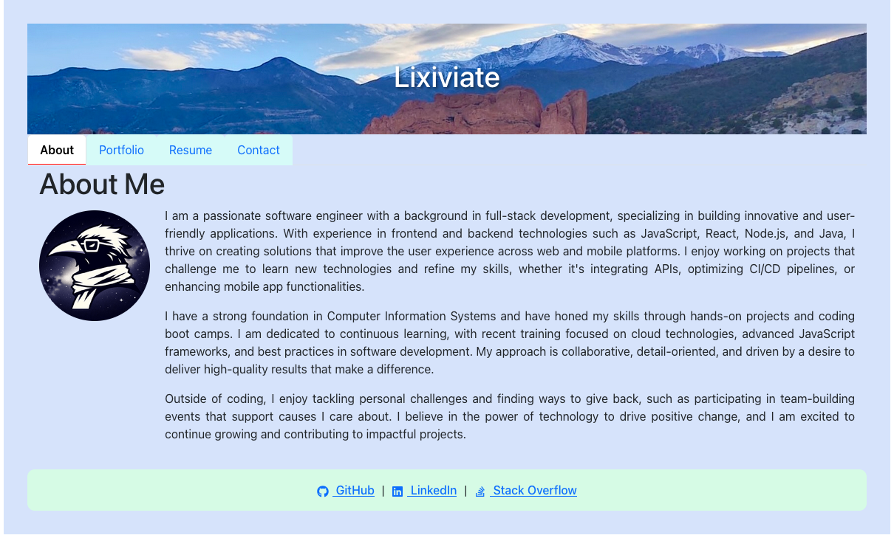

# C20-react-portfolio

## Project Description

This is a single-page React portfolio showcasing my work as a web developer. The portfolio is designed with a modern, responsive layout and features sections for About Me, Portfolio, Contact, and Resume. It serves as a professional portfolio to highlight my skills, projects, and experience.

## Features

- **Responsive Design:** Built to work seamlessly across various screen sizes and devices.
- **Navigation:** Intuitive navigation with links to different sections of the portfolio (About Me, Portfolio, Contact, and Resume).
- **About Me:** A brief bio section with details about my background and expertise.
- **Portfolio Section:** Displays examples of my work, each with links to the corresponding GitHub repositories.
- **Resume Section:** A downloadable link to my resume.
- **Contact Section:** Allows users to connect with me via my GitHub profile.

## Usage

### Running Locally

1. Clone the repository:

```bash
git clone https://github.com/Lixiviate/C20-react-portfolio.git
```

2. Navigate to the project directory:

```bash
cd C20-react-portfolio
```

3. Install dependencies:

```bash
npm install
```

4. Start the development server:

```bash
npm run dev
```

5. Open your browser and visit http://localhost:3000 to view the portfolio.

## Link to Demo + Example(s)

The portfolio is deployed via netlify. You can access the deployed version [HERE](https://lixiviate-portfolio.netlify.app/).



## Source Code

- Created by [Lixiviate](https://github.com/Lixiviate)

- Code Assistance:
  - [MDN Web Docs](https://developer.mozilla.org/en-US/)
  - [W3Schools](https://www.w3schools.com/)
  - [edX Xpert Learning Assistant](https://www.edx.org/)
  - [Stack Overflow](https://stackoverflow.com/)
- Development Resources:
  - [React.js](https://www.npmjs.com/package/react)
  - [React Router](https://www.npmjs.com/package/react-router-dom)
  - [React Bootstrap](https://www.npmjs.com/package/react-bootstrap)
  - [React Icons](https://www.npmjs.com/package/react-icons)
  - [vite](https://www.npmjs.com/package/vite)
  - [eslint](https://www.npmjs.com/package/eslint)

## License

This project is licensed under the MIT license.
